**Selective, Interpretable and Motion Consistent Privacy Attribute Obfuscation for Action Recognition**<br>
CVPR 2024<br>
Filip Ilic, He Zhao, Thomas Pock, Richard P. Wildes<br>

---

[[Project Page]](https://f-ilic.github.io/SelectivePrivacyPreservation)
[[Paper]](TODO)

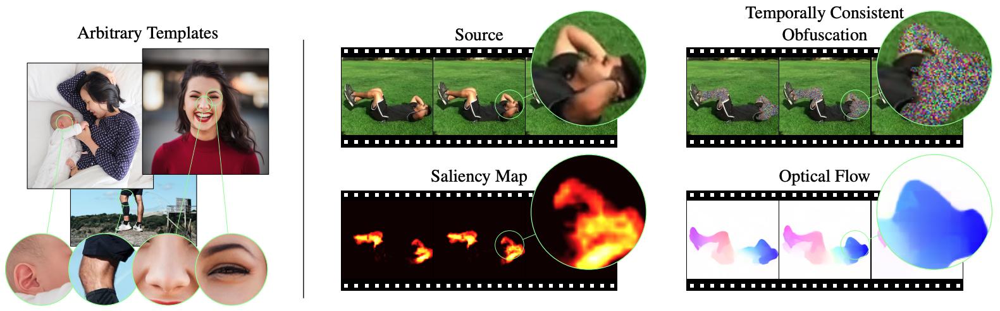

> **The goal is to hide privacy relevant attributes without action recognition performance dropping.**
We show that it is not necessary to train action
recognition and privacy networks in an adversarial fashion
for effective obfuscation of privacy attributes while 
maintaining strong action recognition performance. We show
that a system based on local privacy templates, deep 
features that capture <ins>template semantics</ins> and <ins>selective noise obfuscation</ins> that is animated with source video motion can uphold privacy without hindering action recognition. Our approach is unique compared to alternative recent approaches
in terms of <ins>interpretability</ins>.

# Environment Setup
```bash
git clone git@github.com:f-ilic/SelectivePrivacyPreservation.git
conda env create -f environment.yaml
```


## Quickstart

We provide a `launch.json` for VSCode with all relevant run targets. Everything should work out of the box, after you set up the [Datasets](#datasets). 
<details>
  <summary>VSCode Run Targets</summary>

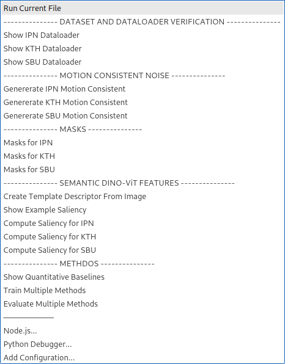
</details>

<details>
  <summary>Otherwise</summary>


In case you are not running this from a IDE that sets the `PYTHONPATH` to the to the root directory (`cwd`) you need to manually set it with
```
export PYTHONPATH="/path/to/this/project:$PYTHONPATH"
```
Alternatively `cd` into the `SelectivePrivacyPreservation/` and `export PYTHONPATH="./"` while exploring the codebase.
</details>

# Datasets 

Our evaluations utilize three datasets:
[IPN](https://gibranbenitez.github.io/IPN_Hand/), [SBU](http://vision.cs.stonybrook.edu/~kiwon/Datasets/SBU_Kinect_Interactions/README.txt), [KTH](https://www.csc.kth.se/cvap/actions/)


Please download, extract, and organize each dataset in its original structure under `data/<ipn|kth|sbu>`. The directories should contain individual frames. For the IPN dataset, you'll need to download `frames/frames[00-05].tar.gz`. The KTH and SBU datasets are already organized as individual frames.

The dataset splits are provided in `data/splits/<ipn|kth|sbu>`.

Other intermediate results, such as saliency maps for each template, will be saved in `data/` following the naming scheme `<ipn|kth|sbu>_<modality>`, where `modality` includes `<masks|flow|afd>`. Instructions for generating these modalities are provided below.


Use the `sim` postfix for similarity maps generated by the [Matcher](#saliency-maps-for-each-dataset) (`<ipn|kth|sbu>_<template>_sim`), and store them in `data/`. The dataloaders depend on this structure; modifications to source files will be necessary otherwise.


## Dataset and Dataloader Verification
To verify correct dataset placement and functionality of the Anaconda environment, run:

```
python dataset/db_factory.py --datasetname ipn
```

Select the dataset with:
```
--datasetname DATASETNAME       options: [ 'ipn' | 'kth' | 'sbu' ]
```


This command launches a Matplotlib window, allowing you to navigate through dataset clips with your mouse wheel.

## Motion Consistent Noise
Files for creating motion-consistent noise patterns are in [`afd/`](afd/), following the implementation from ["Is Appearance-Free Action Recognition Possible?"](https://github.com/f-ilic/afd/).

To generate the (optianal) flow and (required) motion consistent noise data for the datasets run 
```
python afd/generate_<ipn|kth|sbu>.py
```
This populates `data/<ipn|kth|sbu>_afd` and `data/<ipn|kth|sbu>_flow` directories.

For experiments with optical flow output, adjust `generate_<ipn|kth|sbu>`. Due to storage concerns, flow is stored as compressed RGB-Middlebury flow in JPEG format; see [`afd/flowiz.py`](afd/flowiz.py) for details.

## Masks

Naive baselines requiring masking or blurring of individuals in videos necessitate mask creation for each dataset.

Code in [`yolo/`](yolo/) usees the [Ultralytics](https://github.com/ultralytics) YOLOv8 implementation for mask generation across the provided datasets.

For IPN and KTH run:
```
python yolo/create_masks_ipn_or_kth.py --src data/ipn --dst data/ipn_masks
```

For SBU, due to its nested file structure:

```
python yolo/create_masks_sbu.py --src data/sbu --dst data/sbu_masks
```

<details>
  <summary>Commandline Arguments</summary>

Specify source and destination directories:
```
--src SRC   Source directory from which to read the images
--dst DST   Destination directory to write the masks
```
</details>

# Semantic DINO-ViT Features

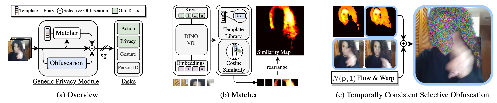
The paper's templates are located in `output/descriptors/`, saved as PyTorch tensors.

To generate new templates interactively from any image for your obfuscation pipeline use 
* [`matcher/save_descriptor.py`](matcher/save_descriptor.py) 
* [`matcher/compute_similarities_from_descriptor.py`](matcher/compute_similarities_from_descriptor.py).


## Template Creation
Create a new template with:
`save_descriptor.py -template <pathToImg> -descriptorname <filename>`.

A Matplotlib window will open; double-click on the image part you wish to use as the template feature. The feature's spatial location is saved under `<filename>`. You can select the `facet` (key, query, or value) and layer (`default: 11`) for feature extraction within the file, with the `key` facet recommended as per the paper.


<details>
  <summary>Commandline Arguments</summary>

```
  -h, --help            show this help message and exit
  -template TEMPLATE    The template image from which to extract the descriptor
  -descriptorname DESCRIPTORNAME
                        Name of the descriptor to save in output/descritors/
  --model_type MODEL_TYPE
                        type of model to extract. Choose from [dino_vits8 | dino_vits16 | dino_vitb8 | dino_vitb16 |
                        vit_small_patch8_224 | vit_small_patch16_224 | vit_base_patch8_224 | vit_base_patch16_224]
  --facet FACET         facet to create descriptors from. options: ['key' | 'query' | 'value' | 'token']
  --layer LAYER         layer to create descriptors from.
  ```
</details>

For a demo we've included an image from IPN that you can test it on (double click on the mouth of the person when the matplotlib window pops up): 
```
python matcher/save_descriptor.py -template matcher/input/ipn1.jpg -descriptorname mouth.pt
```

##  Matcher
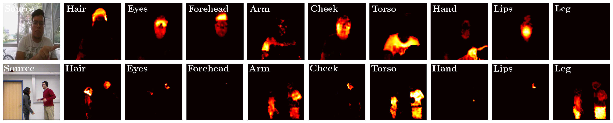

Matching a template across an image sequence is performed in the [`matcher/`](matcher/) directory:

```
compute_similarities_from_descriptor.py -descriptorpath <pathToSavedDescriptor> -imagesdir <pathToDirContainingImages>
```

<details>
  <summary>Commandline Arguments</summary>
It has almost identical settings as the descritpor saving:

```
  -h, --help            show this help message and exit
  -descriptorpath DESCRIPTORPATH
                        The descriptor to compare to
  -imagesdir IMAGESDIR  Directory with images to compare to compare the descriptor to and compute the smiliarity
  --model_type MODEL_TYPE
                        type of model to extract. Choose from [dino_vits8 | dino_vits16 | dino_vitb8 | dino_vitb16 |
                        vit_small_patch8_224 | vit_small_patch16_224 | vit_base_patch8_224 | vit_base_patch16_224]
  --facet FACET         facet to create descriptors from. options: ['key' | 'query' | 'value' | 'token']
  --layer LAYER         layer to create descriptors from.
  --use_targeted USE_TARGETED
                        Match descriptor to first image in sequence, or use raw.
```
</details>

Use the same settings as you did for the extraction of the descriptor with `save_descriptor`; otherwise you will get terrible matches.

In the repository we also provide a image sequence located in [`matcher/input/testvideo/`](matcher/input/testvideo) that you can run with your previously extracted descriptor to see if everything works as expected.
Run:

```
python matcher/compute_similarities_from_descriptor.py -descriptorpath output/descriptors/mouth.pt -imagesdir input/testvideo/
```

This populates `output/similarities/mouth_testvideo` with the saliency maps, already upscaled to match the input image dimensions.


To verify a single example with an extracted template feature you can run 
```
python visualize_qualitative/similarity_from_tempate_vis.py --image matcher/input/ipn2.jpg --descriptor output/descriptors/hair.pt
```

to load [`matcher/input/ipn2.jpg`](matcher/input/ipn2.jpg) and match it with the `hair` descriptor in [`output/descriptors/`](output/descriptors/).

| Input Image    | Saliency Map  |
|:----------------------:|:----------------------:|
| 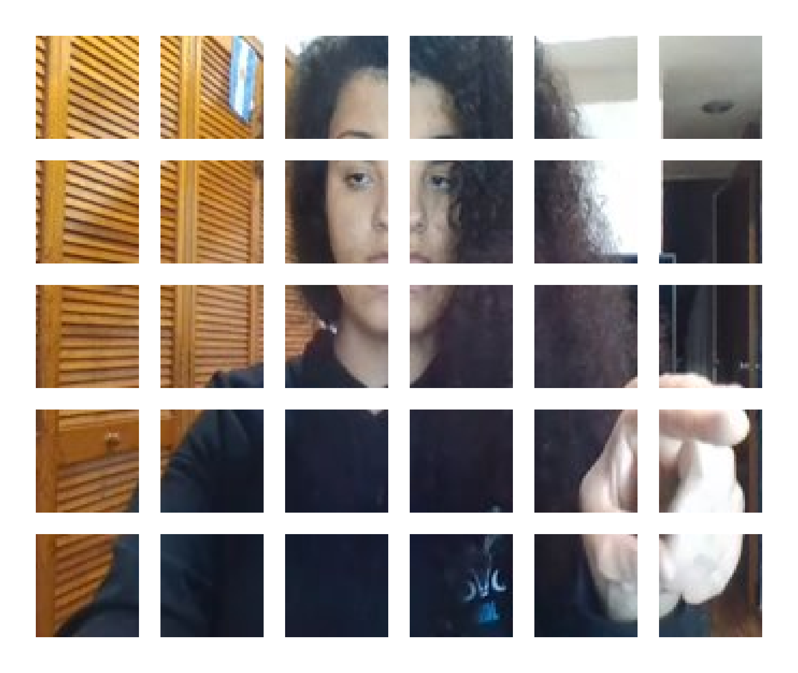 | 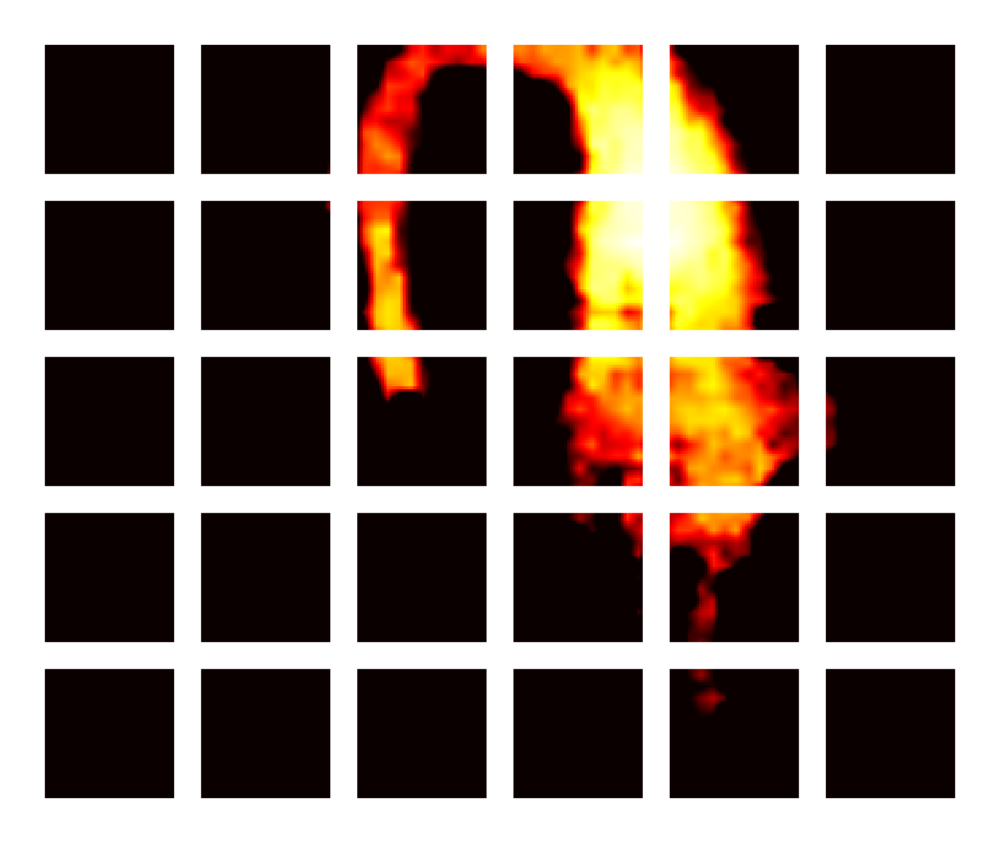 |

##  Saliency Maps for each Dataset

The file [`matcher/similarity_from_template_for_dataset.py`](matcher/similarity_from_template_for_dataset.py) contains the necessary code to create the saliency maps for each dataset, which you need to precompute such that the training and evaluation of the methods presented in the paper works.

Again, make sure that the settings used in `similarity_from_template_for_dataset.py` are the same as in  `save_descriptor.py`. Use the defaults if you want to reproduce our results from the paper.

The datasets have to be prepared as described in the [Dataset](#Datasets)
 section, and be placed/symlinked in [`data/`](data/).

<details>
  <summary>Commandline Arguments</summary>

The usage of the file is identical to `compute_similarities_from_descriptor.py` with the addition of the dataset flag:

```
--dataset DATASET     options: [ 'ipn' | 'kth' | 'sbu' ]
```

</details>

To compute the necessary saliency maps for instance for IPN run:

```
python matcher/similarity_from_template_for_dataset.py -descriptorpath output/descriptors/mouth.pt -dataset ipn
```
This will populate `data/ipn_mouth_sim/` with the similarity maps for the selected `-descriptorpath` file. Note that `similarity_from_template_for_dataset.py` can recover from partial completion and unfinished directories. It checks for the integrity of the processed files by comparing the number of images in the target directory for each sequence.
No additional arguments are required, just run it again and it will continue where it left off.

To compute all the attributes for all the datasets you can reference `matcher/run_batch.py`.


# Networks

We evaluate on a wide variety of models; the valid strings that identfy the models [`models/valid_models.py`](models/valid_models.py).

Each model communicates its required sampling of a video clip ($f \times r$) with the dataloader, and no additional configuration is required.

The following strings are valid ```ARCHITECTURE``` command line parameters for ```--architecture ARCHITECTURE```


<details>
  <summary>Privacy Classification Networks</summary>

```
resnet18
resnet50
resnet101
vit
vit_b_32
```
</details>

<details>
  <summary> Action Classification Networks</summary>

```
x3d_s
x3d_m
x3d_l
slowfast_r50
slow_r50
i3d_r50
c2d_r50
csn_r101
r2plus1d_r50
mvit_base_16x4
e2s_x3d_s
e2s_x3d_m
e2s_x3d_l
```
</details>


## Training & Evaluation
Training is straight forward; the logger found in [`simulation/`](simulation) logs tensorboard entries and other data, and saves it so that it can later be read out and processed to create the tables for all the network architectures and modalities to be evaluated.

The evaluation code is almost identical to the training code and is also intended to be evaluated automatically by parsing the resulting tensorboard files.

We include the analysis file that produces correctly formatted latex tables with all the selected tensorboard files that are found in `runs/`, see Section [Analysis](#analysis).


The files that allow you to run the training and evalution are:
* [`action_train.py`](action_train.py) 
* [`privacy_train.py`](privacy_train.py)
* [`action_eval.py`](action_eval.py) 
* [`privacy_eval.py`](privacy_eval.py) 

---
The command line parameters for all the afforementioned training and evaluation files is split into 3 groups **Training**, **Evaluation**, and **Our Method**. The ArgParse that is used for almost all files relating to network training and evaluation can be found in [`config.py`](config.py).

<details>
  <summary> Training</summary>

```
  --architecture ARCHITECTURE
  --datasetname DATASETNAME
  --weights_path WEIGHTS_PATH
  --num_epochs NUM_EPOCHS
  --num_workers NUM_WORKERS
  --batch_size BATCH_SIZE
  --num_frames NUM_FRAMES
  --lr LR
  -pretrained
  -train_backbone
  -privacy
  --gpus GPUS [GPUS ...]
  --accumulate_grad_batches ACCUMULATE_GRAD_BATCHES
```
</details>

<details>
  <summary> Evaluation</summary>

```
  --masked MASKED
  --downsample DOWNSAMPLE
  --interpolation INTERPOLATION
  --blur BLUR
  --afd_combine_level AFD_COMBINE_LEVEL
  -combine_masked
  --downsample_masked DOWNSAMPLE_MASKED
  --interpolation_masked INTERPOLATION_MASKED
  -mean_fill
```
</details>

<details>
  <summary> Our Method</summary>

```
  -selectively_mask
  --obfuscate OBFUSCATE [OBFUSCATE ...]
  -iid
```
</details>


To evaluate all the architectures that you want, it is straight forward to add or modify  [`batch_train.py`](batch_train.py), and [`batch_eval.py`](batch_eval.py).

The `batch` files just call the `action` / `privacy` files and set the command line parameters for multiple experiments.


## Analysis

We try to provide all necessary files to reproduce the results if you decide to retrain all networks from scratch and evaluate them.
The following analysis section highlights important files that are usefull to create ablations and visualize intermediate results.

||
|:---:|
|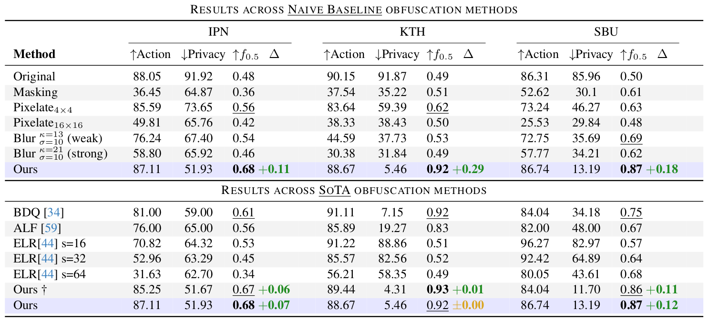|
|[`create_table_privacy.py`](create_table_privacy.py) and [`create_table_action.py`](create_table_action.py)|


There are additional files in [`ablation/`](ablation/) that were used to create ablations in Fig.5 and Fig.8 in the paper.

|Ablation over the obfuscation performance of individual templates|
|:-----:|
|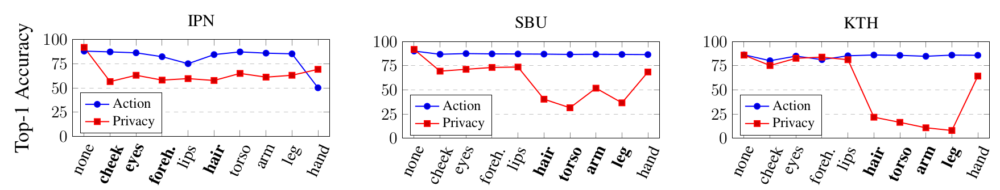|
| [`Fig5_ablate_individual_template.py`](ablation/Fig5_ablate_individual_template.py)|


The [`visualize_qualitative/`](visualize_qualitative/), and [`visualize_quantitative/`](visualize_quantitative/) directory contain files useful for qualitative analysis of baseline methods and the saliency matching based on selected templates.

| Naive Baseline methods |
|:-----:|
|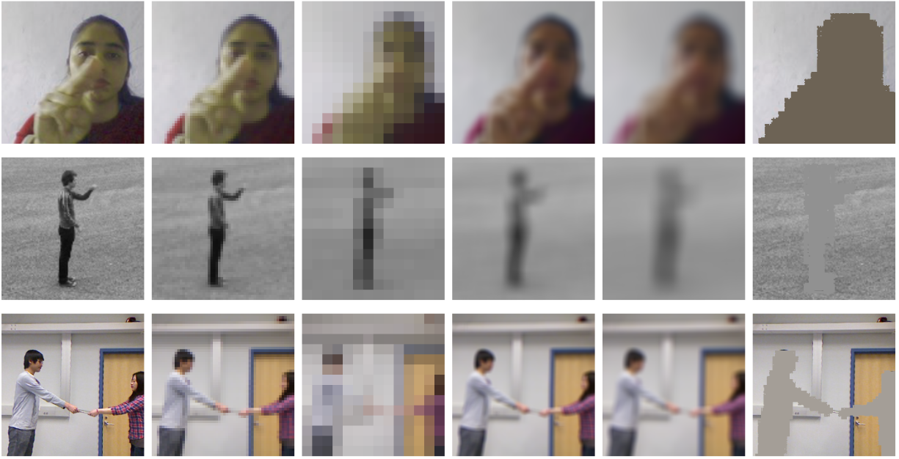|
|[`baselines_qualitative_vis.py`](visualize_qualitative/baselines_qualitative_vis.py)


The average $f_{\lambda}$ value across all datasets can be plotted in $\LaTeX$-pgf with [`visualize_quantitative/Fig7_pgf_plots_average.py`](visualize_quantitative/Fig7_pgf_plots_average.py).

Additional ablation plots can be created as shown below: 


|Individual per dataset results| _iid_ vs. Motion consistent Noise|
|:---:|:---:|
| 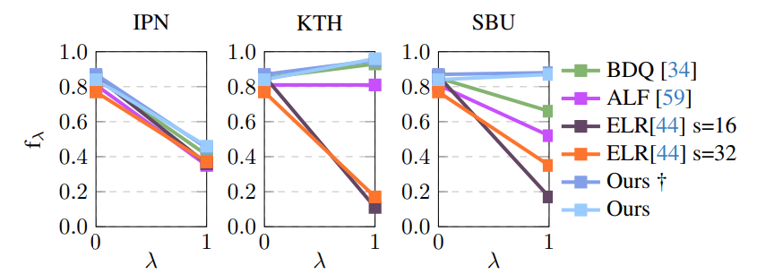 | 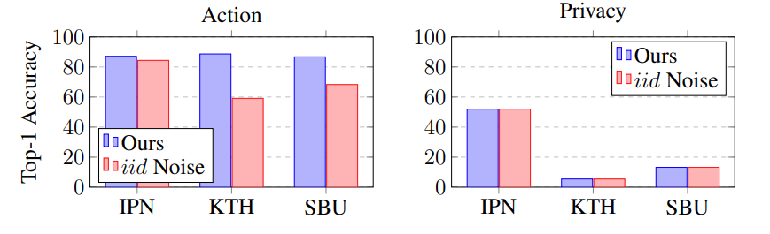 |
| [`Fig7_pgf_plots_individual.py`](visualize_quantitative/Fig7_pgf_plots_individual.py) |[`Fig8_ablate_iidnoise_video_architecture.py`](ablation/Fig8_ablate_iidnoise_video_architecture.py) |


# Acknowledgements

Parts of this project use code from the following repositories:

* https://github.com/f-ilic/AppearanceFreeActionRecognition
* https://github.com/ShirAmir/dino-vit-features
* https://github.com/facebookresearch/pytorchvideo
* https://github.com/ultralytics/ultralytics
* https://github.com/ibaiGorordo/ONNX-YOLOv8-Instance-Segmentation
* https://github.com/f-ilic/SimulationHelper
* https://github.com/georgegach/flowiz


# Cite
```bibtex
@inproceedings{ilic2024selective,
  title={Selective, Interpretable and Motion Consistent Privacy Attribute Obfuscation for Action Recognition},
author={Ilic, Filip and Zhao, He and Pock, Thomas and Wildes, Richard P.},
  booktitle={Conference on Computer Vision and Pattern Recognition (CVPR)},
  year={2024}
}
```


